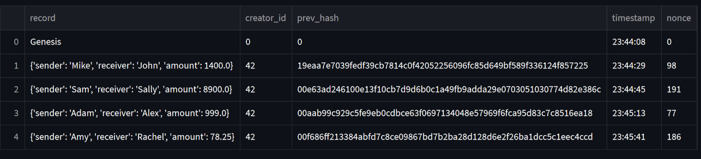
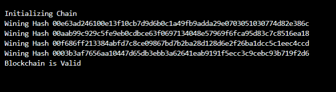
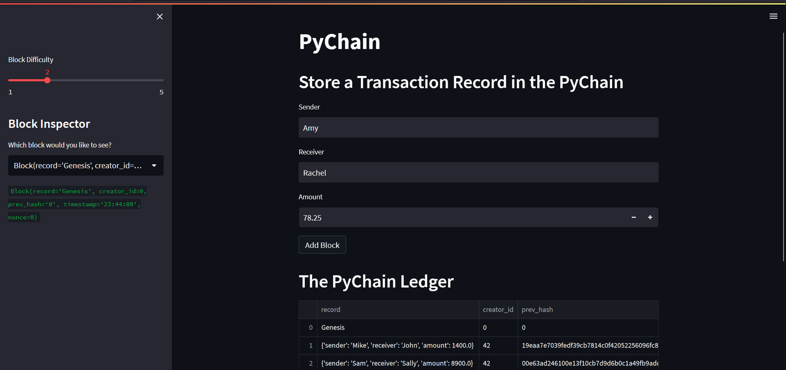

# **Fintech Bootcamp Challenge 18**


A blockchain-based ledger system, complete with a user-friendly web interface. The ledger allows users(banks) to conduct financial transactions (that is, to transfer money between senders and receivers) and to verify the integrity of the data in the ledger.

---

## **Technology**

---

### Technology used:

- Python 3.7
- Python Code
- Python file (.py)

### Libraries used:

- Pandas
- Streamlit
- hashlib
- typing
- datetime
- dataclass

---

## **Installation Guide**

---

Before running the application first install the following dependencies
 
 ```python
   pip install pandas
   pip install streamlit
   pip install datetime
   pip install dataclasses
   pip install hashlib
   pip install typing
```

---

## **Usage**

Run the .py file in the terminal system using the following code:

```python
  streamlit run pychain.py
```

This code opens the user-friendly webpage where you can test the ledger.

---

### Functionality of the chain:



### Validation of the blockchain:




### Streamlit webpage:



---

### **Contributors**

- Gorovodskiy, Herman (ggorovod01@gmail.com) 


### **License**
---

MIT